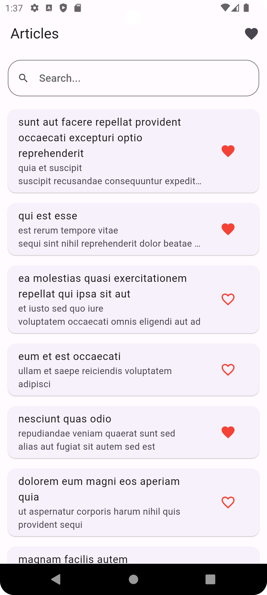
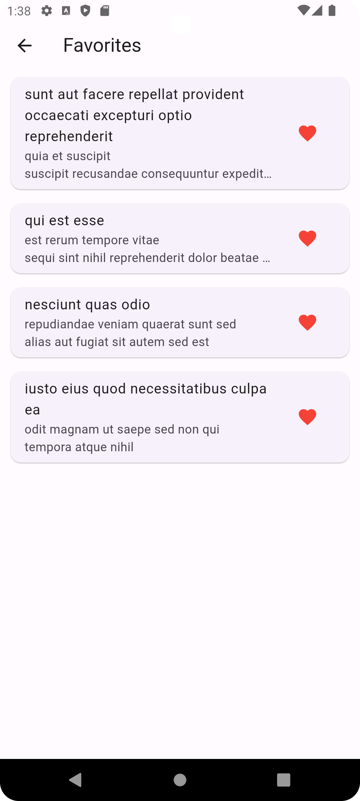
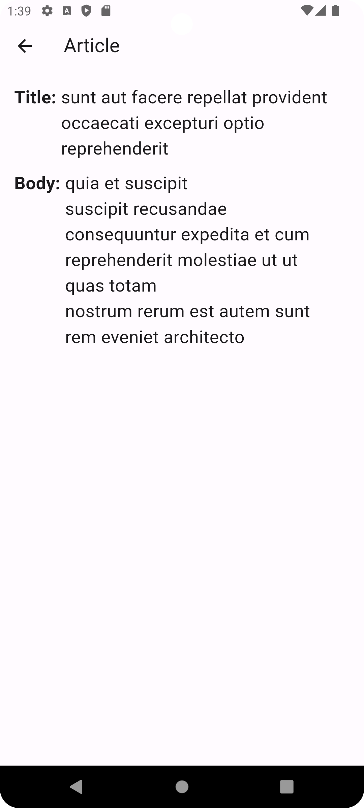

# BharatNXT_Next

A Flutter app that fetches and displays a list of articles from a public API.

## Features

- List of articles from `https://jsonplaceholder.typicode.com/posts`
- Search functionality (client-side)
- Article detail view
- Add/remove favorites
- Favorites tab with persistent storage
- Responsive UI with error and loading states
- Pull-to-refresh support

## Setup Instructions

1. Clone the repo:

   git clone https://github.com/Devesh190/BharatNXT_Next.git
   cd BharatNXT_Next
2. Install dependencies:

   flutter pub get
   dart run build_runner build --delete-conflicting-outputs
3. Run the app:

   flutter run

## Tech Stack
Flutter SDK: 3.19.4

State Management: Provider

HTTP Client: http

Persistence: Hive

## State Management Explanation
We used Provider for managing the global state of the articles and favorites. 
ArticleProvider handles API fetching, local search, and favorites management. 
UI widgets like ArticleCard and HomeScreen use Consumer widgets or Provider.of() 
to respond to state changes and rebuild efficiently

## Known Issues / Limitations

No pagination – all posts are fetched at once.

No offline caching of articles (only favorites are persisted).

## Screenshots

